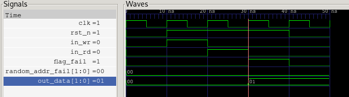
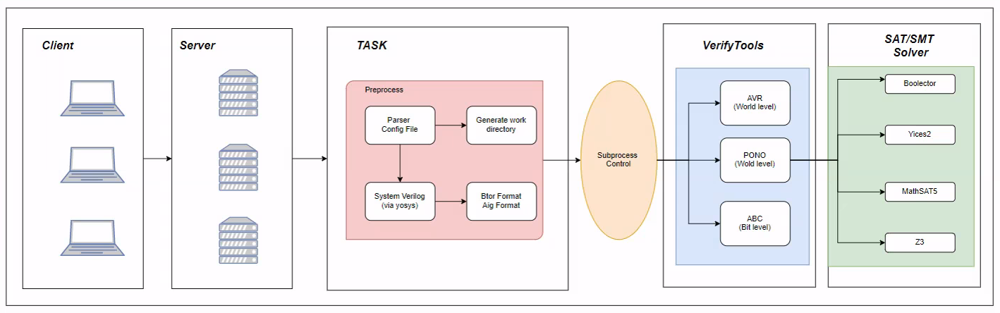

#  DHMC: Distributed Verified Tool Based On Model Checking
DHMC is a tool working with Client/Server architecture for Hardware Model Checking.Once environment configuration has been done on server,one can use it's service to check hardwave design conveniently.
# How  to Build it
## We recommend use our tool with docker. 
Follw the [tutorial](https://docs.docker.com/desktop/install/windows-install/) install on Windows. If you use linux , follow this [tutorial](https://docs.docker.com/desktop/install/linux-install/).
1. pull the image with docker command:   **docker pull dianmei/csmc:v1**
2. create a containter: **docker run -itd --name="csmc" -p 2678:2678  [image ID]**
3.  run the containter: ** docker exec -it csmc /bin/bash**
4. use the tool: 
	1) cd the csmc directory:  **cd /root/csmc/**
	2) read the uasge: **python3 server.py -h**
	3) start the service: **python3 server.py -ip 0.0.0.0 -p 2678 -o /root/data/ & **
5.  use a client to connect the server.
We use local client.  Modify the config file in the test/config_test diectory. Use config.toml. Change the ip to localhost. 
Run the client:  **python3 client.py test/config_test config.toml**
# Or Build it manually.
## Required Dependence on Server
**Yosys, ABC, PONO and AVR**
The easiest way to use our tool is to install the binary yosys, abc, Pono, which can be found at [oss-cad-suit-build](https://github.com/YosysHQ/oss-cad-suite-build). Just download and install it.

Or:
You can also build them manually as follows.
-  Building Yosys and  ABC. Note that this will install Yosys and ABC(as yosys-abc):
<https://yosyshq.net/yosys/>
```
git clone https://github.com/YosysHQ/yosys
cd yosys
make -j$(nproc)
sudo make install
```
- Building [PONO](https://github.com/upscale-project/pono)
	- Download/clone the GitHub repository `git clone https://github.com/upscale-project/pono.git`
	- RUN `cd pono`
	- If you don't have bison and flex installed globally, run:`./contrib/setup-bison.sh` and `./contrib/setup-flex.sh`
	- RUN `./contrib/setup-btor2tools.sh.`
	- Download the Mathsat solver from https://mathsat.fbk.eu/download.html, unpack it and rename the directory to `./deps/mathsat`
	- RUN `./configure.sh --with-msat`
	- RUN `cd build`
	- RUN `make -j$(nproc)`

- Building [AVR](https://github.com/aman-goel/avr)
	- Download/clone the GitHub repository `git clone https://github.com/aman-goel/avr.git`
	- RUN `cd avr`
	- RUN `/build.sh`
**NOTE: For more SMT-solver support,you should enable appropriate BACKEND_* flag in src/reach/reach_backend.h to change solver backends in avr project. Look the website carefully .Compile the sorce code and put the binary file in avr build directory .Binary with boolector solver shoud be put in bin_btor, and other solvers is similar. Here is the directory  in avr build directory**
```
build
├── avr
├── bin_btor
├── bin_msat
├── bin_yices
├── bin_z3
```
For more details refer to the [README of AVR](https://github.com/aman-goel/avr).or more details refer to the [README of PONO](https://github.com/upscale-project/pono).

- python3 environment
`pip install tomlkit`
## Required Dependence on Client
Just python3 environment.
`pip install tomlkit`
# Use it
## On server
 **NOTE: First to use. Modify the core/toolpath.py code,change the variable OSS_CAD, AVRPATH, YOSYS,YOSYS_ABC and PONO to the real path where the avr and pono project you have download,make sure you have build them sucessfully.**
Now you can run `python3 server.py -ip [you ip address] -p [port]`,the verify service will start,and ready to work.Tell you cilent the ip and port to enjoy the service.
## On client
Wite the config file.Don't worry the config is easy to write.We use [toml](https://toml.io/en/) to config verify task.
- First define tasks. E.g. `tasks = ["foo","bar"]` define two tasks named foo and bar. `
- Second for each task you shoul define the verify engine you want to use,the mode(bmc or prove),the solver and the other options if have. Then, server section,the ip and port should be provided.For example:
```
[foo]
engine = "avr" # the verify engine
mode = "bmc" # the mode bmc aims to find bug
depth = 100    # the bmc's bound
solver = "btor"  # use boolector as solver
ip = "127.0.0.1"
port = "2678"
[bar]
engine = "avr"
mode = "prove" # prove mode primarily prove circuit.
solver = "msat"
ip = "192.168.1.34"
port = "2678"
```
- Then the file section, just put the file name you want to verify and the file type. If the file type is system verilog,top module shoud be declared with key word top.

## Use Our Tool
Config examples can be found in test/config_test directory. Let's take the example of verifying the memory.sv file and introduce the way our 
tool is used. The user needs to write a configuration file as we mentioned above to specify the tool and the algorithm for the verification.
The configuration file for verifying the memory.sv file can be found in test/config_test/memory_sv.toml.
This memory.sv defines a parameterized circuit that stores data, and we expect that given the input address, 
we will always get the correct output. To better display the verification results, we generate a random 
inconsistent error in the circuit so that our tool can detect this error and then give a vcd file. 
That is, a path of the circuit execution. Use command `python3 client.py -c test/memory.toml` to do verification. Then we will get a counterexample.

# The counterexample



# DHMC Tool Flow



